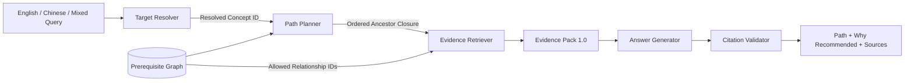

# GraphRAG Learning Path

[中文说明](README.zh-CN.md) · [Evaluation Summary](evals/reports/stage6_summary.md) · [Implementation Roadmap](IMPLEMENTATION_ROADMAP.md)

A multilingual, prerequisite-constrained GraphRAG system that combines complete prerequisite-graph reasoning, cross-lingual retrieval, relationship-level Evidence Packs, deterministic citation validation, and modular evaluation to produce explainable and traceable learning paths.


## Why This Project Exists

A semantic match can suggest relevant concepts, but relevance alone cannot guarantee a valid learning order. This project separates the responsibilities that are often blended inside a RAG pipeline:

- the graph determines the complete prerequisite path;
- multilingual retrieval resolves a target and selects evidence, but never changes the path;
- the Answer Generator can cite only relationship IDs in the current Evidence Pack;
- a deterministic validator removes unknown citations before the API responds.

## Architecture



The core contract is deliberately narrow:

```text
query → resolved target → graph-safe path → scoped relationship evidence
      → grounded answer → validated citations
```

## Cross-Language Example

```text
Query:    What should I learn before studying Karnaugh maps?
Target:   卡诺图构成 / Karnaugh Map Construction (c_006)
Path:     Binary fundamentals → Truth tables → Boolean algebra
          → Minterms and maxterms → Karnaugh map construction
Evidence: Stable prerequisite relationship IDs from Evidence Pack 1.0
Answer:   English by default; Chinese can be selected explicitly
```

The public sample contains 15 synthetic, curated bilingual concepts and 18 relationship-level evidence records. The full local validation graph contains 190 Chinese concepts and 409 prerequisite relationships; it is not redistributed because its source material is not public.

## Measured Results

| Module | Primary Result | Scope |
| --- | ---: | --- |
| Target Resolver | Top-1 30/30; cross-language Top-1 10/10 | 36 directional fixtures |
| Path Planner | Closure recall 1514/1514; 0 structural violations | all 190 local targets |
| Evidence Retriever | Graph-scoped Recall@5 6/6; Citation Integrity 6/6 | 6 labelled fixtures |
| Answer Generator | Language match 6/6; invalid evidence IDs 0 | offline fallback + fake contract tests |

These are directional engineering evaluations, not claims of statistical generalisation. No external LLM was called for the versioned Answer Generator report: deterministic fallback claim lineage measured `0/6` unsupported claim templates, while real-model unsupported-claim rate and human faithfulness remain explicitly unmeasured. See the [four independent scorecards and feature ablation](evals/reports/stage6_summary.md).

Key decisions supported by the ablation:

- keep `intfloat/multilingual-e5-small` for multilingual retrieval;
- keep complete cached graph closure instead of depth-limited traversal;
- keep relationship retrieval constrained to the planned graph path;
- leave the evaluated CrossEncoder reranker disabled because it reduced overall and English Top-1 quality;
- always retain deterministic bilingual answer fallback and citation validation.

## Run the Public Sample

### macOS / Linux

Prerequisites: Python 3.11–3.13 and Node.js 18+. The public CSV graph mode does not require Docker or Java.

```bash
./setup.sh
./start-dev.sh
```

Stop the services with `./stop-dev.sh`.

### Windows PowerShell

The original Windows scripts remain supported and use the bundled Neo4j runtime:

```powershell
.\setup.ps1
.\start-dev.ps1
```

Stop with `.\stop-dev.ps1`.

Open the frontend at <http://127.0.0.1:5173>, API docs at <http://127.0.0.1:8000/docs>, and Neo4j Browser at <http://127.0.0.1:7474>.

For the full local graph, set `GRAPH_BACKEND=neo4j` and start Neo4j with `docker compose up -d neo4j` or your local installation. The Compose password is for development only; set `NEO4J_PASSWORD` to override it.

## Test and Reproduce Reports

```bash
cd backend
.venv-unix/bin/python -m pytest
cd ..
backend/.venv-unix/bin/python evals/stage6_report.py
cd frontend
npm run build
```

The public end-to-end test runs the English question above through graph closure, evidence retrieval, Evidence Pack construction, bilingual fallback generation, and citation validation without Neo4j or a network call.

## Repository Map

- `backend/app/graph/` — immutable graph snapshots and complete prerequisite closure.
- `backend/app/retrieval/` — multilingual concept and relationship retrieval, caches, fusion, and optional reranking.
- `backend/app/evidence/` — Evidence Pack construction and citation validation.
- `backend/app/services/` — target resolution, planning, GraphRAG orchestration, and answer generation.
- `frontend/` — English-first Vue interface with path, evidence, and graph inspection.
- `data/seed/` — public bilingual synthetic sample.
- `evals/` — versioned datasets, runners, JSON reports, Markdown scorecards, and ablations.

## Technology

FastAPI · Neo4j · Vue 3 · ECharts · multilingual E5 · optional CrossEncoder · deterministic structured fallback
